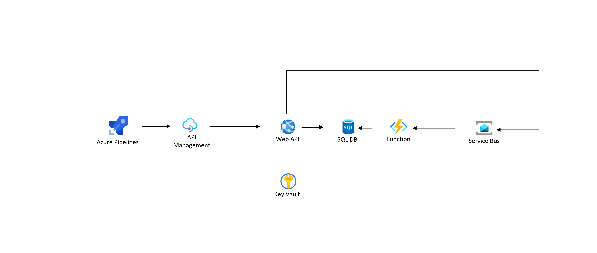
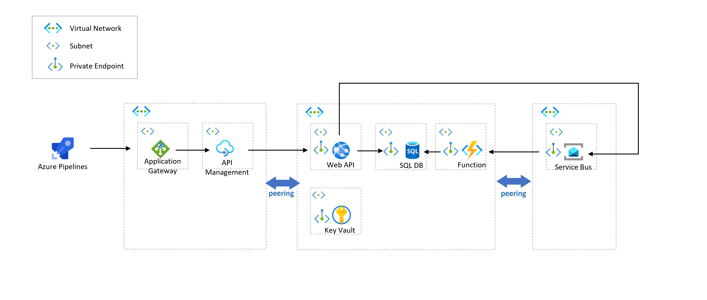
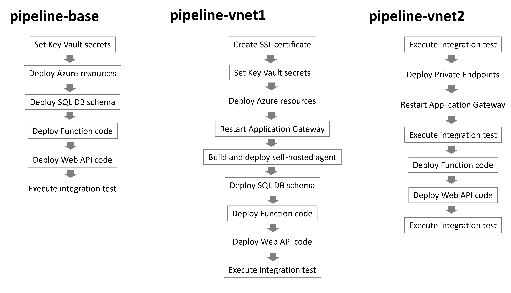

# Overview
This template includes a sample Web API architecture with and without virtual networks and pipelines that automate deployment and integration test process. The pipelines deploy Azure resources and sample codes for the Web API and Functions, and then send requests to the API in the integration steps. Follow the instruction in [Getting-Started](./docs/Getting-started.md) to run this template.

## Reference

- [Virtual Network architecture 1 - Do I need virtual network?](https://dev.to/koheikawata/virtual-network-architecture-1-do-i-need-virtual-network-1nhk)
- [Virtual Network architecture 2 - Deployment pipelines](https://dev.to/koheikawata/virtual-network-architecture-2-deployment-pipelines-39p5)
- [Virtual Network architecture 3 - Key Vault Private Endpoint](https://dev.to/koheikawata/virtual-network-architecture-3-key-vault-private-endpoint-43nj)
- [Virtual Network architecture 4 - SQL Database Private Endpoit](https://dev.to/koheikawata/virtual-network-architecture-4-sql-database-private-endpoit-49o2)
- [Virtual Network architecture 5 - App Service Private Endpoint](https://dev.to/koheikawata/virtual-network-architecture-5-app-service-private-endpoint-5eao)
- [Virtual Network architecture 6 - Service Bus Private Endpoint](https://dev.to/koheikawata/virtual-network-architecture-6-service-bus-private-endpoint-oa)
- [Virtual Network architecture 7 - Self-hosted agent](https://dev.to/koheikawata/virtual-network-architecture-7-self-hosted-agent-32j4)

**Azure services used**

- [Azure Active Directory](https://docs.microsoft.com/en-us/azure/active-directory/fundamentals/active-directory-whatis)
- [Azure Application Gateway](https://docs.microsoft.com/en-us/azure/application-gateway/overview)
- [Azure API Management](https://docs.microsoft.com/en-us/azure/api-management/api-management-key-concepts)
- [Azure App Service](https://docs.microsoft.com/en-us/azure/app-service/overview)
- [Azure Functions](https://docs.microsoft.com/en-us/azure/azure-functions/functions-overview)
- [Azure SQL](https://docs.microsoft.com/en-us/azure/azure-sql/azure-sql-iaas-vs-paas-what-is-overview)
- [Azure Key Vault](https://docs.microsoft.com/en-us/azure/key-vault/general/overview)
- [Azure Service Bus](https://docs.microsoft.com/en-us/azure/service-bus-messaging/service-bus-messaging-overview)
- [Azure Virtual Network](https://docs.microsoft.com/en-us/azure/virtual-network/virtual-networks-overview)
- [Private Endpoint](https://docs.microsoft.com/en-us/azure/private-link/private-endpoint-overview)
- [Azure Pipelines](https://docs.microsoft.com/en-us/azure/devops/pipelines/get-started/what-is-azure-pipelines)

# Architectures

## without v-net(base) 

This architecture has a basic Web API managed by Azure API Management. Azure Pipelines agent sends a request to the API Management endpoint during the integration test pipeline. The Web API includes GET, DELETE, and two POST methods. One of POST requests forward a requested message to Azure Service Bus, and the Azure Functions is triggered according to messages sent to the Service Bus topic and Functions set records to Azure SQL Database.

## with v-net

This architecture is the one that adds to the **base** architecture virtual networks and private endpoints so the Azure PaaS resources are proteted by the virtual networks and accessed only through private IP address. It also builds and deploys [self-hosted agent](https://docs.microsoft.com/en-us/azure/devops/pipelines/agents/v2-linux) that builds and deploys Web App and Functions codes to the Azure PaaS resources within the virtual network through private IPs. 

# Deployment processes

The **base** pipeline deploys Azure resources and builds SQL, Web App, Functions codes, deploys them to the Azure PaaS resources, and then execute integration tests. The **vnet1** pipeline deploys Azure resources including virtual networks but the Azure PaaS resources are still exposed to the internet. The **vnet2** pipeline deploys private endpoints and sets up private IPs for the Azure PaaS resources.

